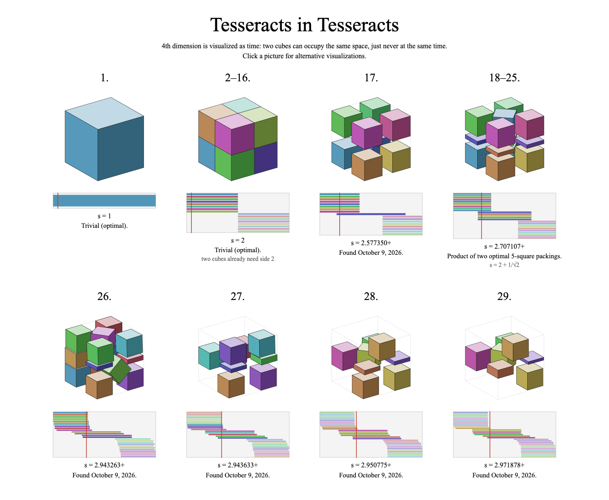

  

<b>Live website: <a href="https://xavierdmello.github.io/tesseract-packing/">https://xavierdmello.github.io/tesseract-packing/</a></b>

# tesseract-packing (site branch)

This branch is the public website, published by GitHub Pages. It's rebuilt automatically from the
[`research`](https://github.com/xavierdmello/tesseract-packing/tree/research) branch, which holds the search engine,
the certified packings and the research notes.

Each picture is a 4D packing of n unit tesseracts in the smallest box we've found. The 4th dimension is shown as time:
two cubes can occupy the same space, just never at the same time.
